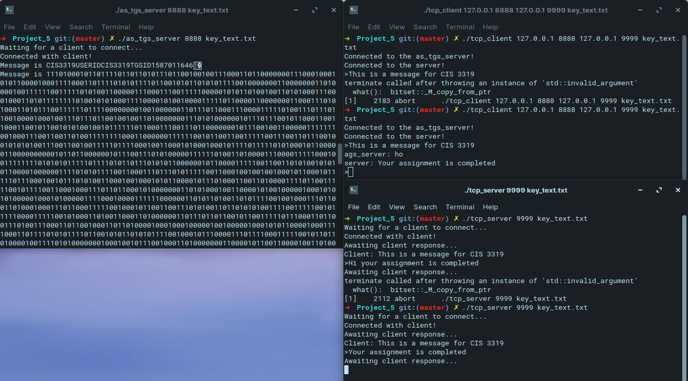

# Kerberos Authentication
Project 5: Kerberos Authentication

## Introduction
A basic Kerberos authentication service with AS_TGS server.

## Design

* Language: C++ 
* IDE: VSCode

```bash
* Support Libraries:
| Libraries              |                         |
| ---------------------- | ----------------------- |
| #include <iostream>    | #include <string>       |
| #include <fstream>     | #include <string.h>     |
| #include <stdio.h>     | #include <stdlib.h>     |
| #include <ctype.h>     | #include <sys/socket.h> |
| #include <unistd.h>    | #include <arpa/inet.h>  |
| #include <sys/types.h> | #include <netinet/in.h> |
| #include <arpa/inet.h> | #include <netdb.h>      |
| #include <sys/uio.h>   | #include <sys/time.h>   |
| #include <sys/wait.h>  | #include <fcntl.h>      |
| #include <cmath>       | #include <bitset>       |
| #include <sstream>     | #include <time.h>       |
```

Main files for the program includes:

1. Design 
* as_tgs_server.cpp
* server.cpp
* client.cpp

2. DES Encryption
* des.cpp

3. Mics
* header.h
* Makefile
* key_text.txt

## Guide 
1. Compile the files & produce the executables
```bash
$ make
```

2. Start the as_tgs_server:
```bash
$ ./as_tgs_server 8888 key_text.txt 
```

3. Start (regular) server
```bash
$ ./tcp_server 9999 key_text.txt 
``` 

4. Start Client
```bash
$ ./tcp_client 127.0.0.1 8888 127.0.0.1 9999 key_text.txt
```

Client will start to authenticate with as_tgs_server and server respectively 




## Contributors
Khai Nguyen: khainguyen@temple.edu